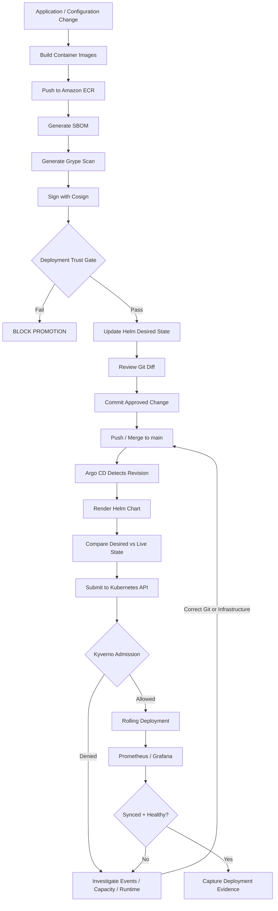

# Final GitOps Workflow

## Final Control Model

The completed platform separates four decisions:

1. **Is the image trusted?** — deployment trust gate.
2. **Is the desired configuration approved?** — Git.
3. **Should the cluster converge to that state?** — Argo CD.
4. **Is the requested Kubernetes object permitted?** — Kyverno.

No single control substitutes for another.
