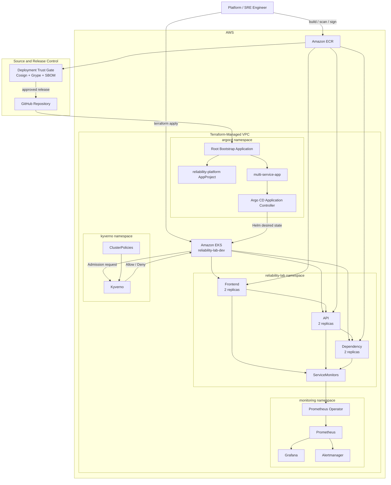

# Final Platform Architecture

## Responsibility Boundaries

| Component | Responsibility |
|---|---|
| Terraform | AWS and EKS infrastructure |
| Git | Approved desired state |
| Helm | Kubernetes manifest rendering |
| Argo CD | Continuous reconciliation |
| Kyverno | Admission governance |
| Cosign | Image signature verification |
| Grype | Vulnerability evidence |
| Syft/CycloneDX | SBOM evidence |
| Prometheus | Metrics and alert evaluation |
| Grafana | Operational visualisation |
| Alertmanager | Alert routing |
| EKS | Workload runtime |

## Final Capacity State

During final evidence capture the EKS managed node group contained four `t3.medium` workers.

The fourth worker was added after a trusted release exposed insufficient Pod scheduling headroom during RollingUpdate.
